# Open Design and Technology  
## Final Project README

> **Project Weight:** 70%  
> **Team Size:** 2 students  
> **Project Duration:** 4 weeks  
> **Class Time Available:** 6 hours per class  
> **Total Time Available:** 48 effort-hours per team  
> **Project Type:** Playful, interactive, technology-based experience

---

# Before you begin

## Fork and rename this repository
After forking this repository, rename it using the format:

`ODT-2026-TeamName`

### Example
`ODT-2026-PixelWizards`

Do not keep the default repository name.

---

# How to use this README

This file is your team’s **working project document**.

You must keep updating it throughout the 4-week build period.  
By the final review, this README should clearly show:
- your idea,
- your planning,
- your design decisions,
- your technical process,
- your build progress,
- your testing,
- your failures and changes,
- your final outcome.

## Rules
- Fill every section.
- Do not delete headings.
- If something does not apply, write `Not applicable` and explain why.
- Add images, screenshots, sketches, links, and videos wherever useful.
- Update task status and weekly logs regularly.
- Use this file as evidence of process, not only as a final report.

---

# 1. Team Identity

## 1.1 Studio / Group Name
``

## 1.2 Team Members

| Name | Primary Role | Secondary Role | Strengths Brought to the Project |
|---|---|---|---|
| `Shraddha` | `Coding` | `not applicable` | `Resourceful` |
| `Ashvanth` | `Electronics` | `not applicable` | `Motivational` |

## 1.3 Project Title
`Vector Strike`

## 1.4 One-Line Pitch
`A mixed reality world which shows the environment of a bowling alley. One can mimic the picking up of the bowling ball, aim for the balls and try to knock them down.`

## 1.5 Expanded Project Idea
In 1–2 paragraphs, explain:
- what your project is,
- what kind of playful experience it creates,
- what makes it fun, curious, engaging, strange, satisfying, competitive, or delightful,
- what technologies are involved.

**Response:**  
`Our project is a mixed reality world in which the virtual world mirrors the real one. One can move their hands and pick up a bowling ball. They may then aim for the pins and release the ball as it goes on to eiether miss or hit the targets.It is competitive and engaging as one wants to keep playing until they knock down all the pins. This virtual environment involves the use of media pipe ( hand tracking and rotation), Unity (the game engine for the virtual world), Thonny and python for receiving the input and connecting the potentiometer values to the virtual hand.`

---

# 2. Philosophy Fit

## 2.1 Experience, Not Social Problem
This module does **not** require your project to solve a large social problem.

You are allowed to build:
- toys,
- games,
- interactive objects,
- playful machines,
- kinetic artifacts,
- humorous devices,
- strange but delightful experiences,
- things that are entertaining to use or watch.

## 2.2 What kind of experience are you creating?
Answer the following:
- What is the experience?
- What do you want the player or participant to feel?
- Why would someone want to try it again?

**Response:**  
`The experience is of one that feels like it belongs in the virtual world just as much as the real one. We want the player to feel a sort of out of world feeling as their real life actions mimic a response in the digital. It also creates an interactive and a playful environment for friends to play and compare their bowling skills. One is drawn to the game and wants to keep coming back to it to score more and feel the thrill of the game, all played virtually.  `

## 2.3 Design Persona
Complete the sentence below:

> We are designing this project as if we are a small creative studio making a **[toy / game / playable object / interactive experience]** for **[children / teens / adults / classmates / exhibition visitors / mixed audience]**.

**Response:**  
`Interactive, fun experience for bowling enthusiats of all age groups.`

---

# 3. Inspiration

## 3.1 References
List what inspired the project.

| Source Type | Title / Link | What Inspired You | ` come back to this `
|---|---|---|
| `make zine` | `https://makezine.com/projects/build-budget-diy-vr-haptic-gloves/` | `The low-cost approach to using flex sensors and the ergonomic layout for mounting components on a standard glove.` |
| `hackaday` | `https://hackaday.io/project/160405-diy-haptic-glove-for-vr` | `The logic for mapping sensor resistance to Unity's physics engine and the use of ESP32 for wireless data transmission.` |
| `aureka sky climber` | `diy haptic glove` | `The implementation of finger-curl translation and the specific use of potentiometers to measure joint rotation.` |

## 3.2 Original Twist
What makes your project original?

**Response:**  
`This is an original idea in the sense that we are combining real life hand movements to something that is intangible. This sensation of feeling something digital in real life is a form of technology which is new and exciting.`

---

# 4. Project Intent

## 4.1 Core Interaction Loop
Describe the main loop of interaction.

Examples:
- press → launch → score → reset
- connect → control → observe → repeat
- turn → trigger → react → repeat
- move object → sensor detects → sound/light response → player reacts

**Response:**  
`move hand - camera + potentiometer detects a change in the legnth of string - hand moves in virtual world - finegrs bend - object is picked up in digital world - hand feels a sensation of something stopping it as the length decreases. Upon release of fingers - potentiometer goes back to original resting position - ball is launched - pins are hit and collide and fall in succession - restart game and balls spawn back. `

## 4.2 Intended Player / Audience

| Question | Response |
|---|---|
| Who is this for? | `VR + E - sports enthusiasts + general public who enjoy bowling` |
| Age range | `all age groups` |
| Solo or multiplayer | `solo` |
| Expected duration of one round | `a minute or lesser` |
| What should the player feel? | `A sense of the virtual bowling alley and feeling of throwing a ball. Feeling the thrill of knocking down balls  ` |
| Is explanation required before use? | `not really , just explain how bowling works - that is to pick up the ball, aim for the pins and do the motion of throwing it` |

## 4.3 Player Journey
Describe exactly how a player will use the project.

1. **Approach:** `wearing the glove`
2. **Start:** `start by moving hand`
3. **First Action:** `keep moving hand to and fro to get the right aim`
4. **Main Interaction:** `release grip on the virtual ball and it should go knock down the pins`
5. **System Response:** `keeps up with their movement and records aim of the wrist and hand`
6. **Win / Lose / End Condition:** `the pins are either knocked down or the player misses the pins`
7. **Reset:** `Restart - balls and pins spawn back `

## 4.4 Rules of Play
If your project is a game, list the rules clearly.

- `stay at the fixed position`
- `don't show the other hand otherwise it will detect that`
- `don't keep hand parallel to the ground `
- `aim for the pins`

---

# 5. Definition of Success

## 5.1 Definition of “Playable”
Your project will be considered complete only if these conditions are met.

- [ ] `the virtual world tracks their movements`
- [ ] `object is succefully picked up`
- [ ] `bending of finegrs is mirrorerd in virtual world and virtual fingers don't move beyond the size of the object even if physical fingers move`
- [ ] `Ball is aimed correctly and hits the pins`
- [ ] `Pins are knocked down`

## 5.2 Minimum Viable Version
What is the smallest version of this project that still delivers the core experience?

**Response:**  
`Picking up of the ball and being able to hold and let go of it.`

## 5.3 Stretch Features
What features are nice to have but not essential?

- `multiple glove sizes - so hands of all sizes can enjoy the game and play it`
- `more realistic and cleaner glove design `
- `[Stretch feature 3]`

---

# 6. System Overview

## 6.1 Project Type
Check all that apply.

- [ + ] Electronics-based
- [ + ] Mechanical
- [ ] Sensor-based
- [ ] App-connected
- [ ] Motorized
- [ ] Sound-based
- [ ] Light-based
- [ + ] Screen/UI-based
- [ ] Fabricated structure
- [ + ] Game logic based
- [ ] Installation / tabletop experience
- [ ] Other: `[Write here]`

## 6.2 High-Level System Description
Explain how the system works in simple terms.

Include:
- input,
- processing,
- output,
- physical structure,
- app interaction if any.

**Response:**  
`It takes in the input of the fingers bending (in terms of the angle with which the knob of the potetiometer moves according to the length of the thread it's attatched to). It also takes in the input of hand movement using media pipe. The output is the virtual hand moving and bending using the inputs. One can then grip the virtual ball, aim for the pins and throw it. Physical structure is the glove itself along with the potetiometers attatched to it.`

## 6.3 Input / Output Map

| System Part | Type | What It Does |
|---|---|---|
| `[Button / Sensor / Switch / App Input]` | Input | ` not applicable ` |
| `[ESP32 ] ` | Processing | `Takes in the potetioneter angles and translates it into values for bending of the finger through python code.` |
| `[ Display]` | Output | `Is the virtual world with the hand, sphere and bowling alley in the enviuronment. Replicates real world movement and imitation of the action of bowling.` |
| `[Mechanical Assembly]` | Physical Action | `Potetiometers have a rubber band and string attatched on the opposite ends. The string is attatched to the finger tips and moves along with the finger as it bends. The rubber band helps in bringing back the knob to its original position when the fingers are uncurled.` |

---

# 7. Sketches and Visual Planning

## 7.1 Concept Sketch
Add an early sketch of the full idea.

**Insert image below:**  
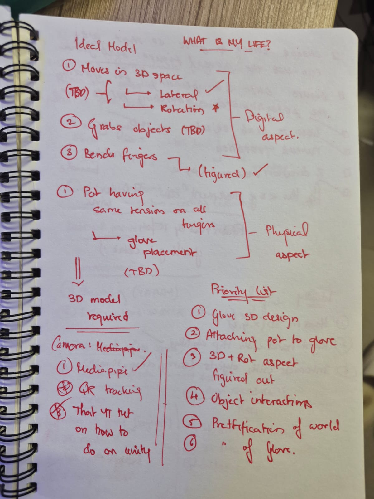
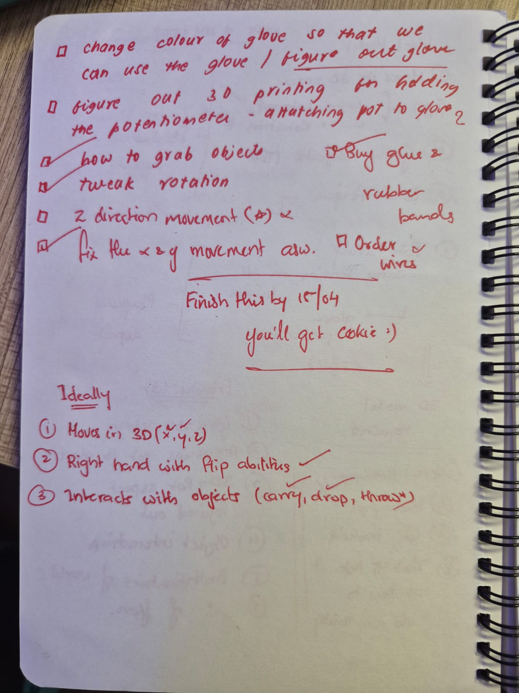
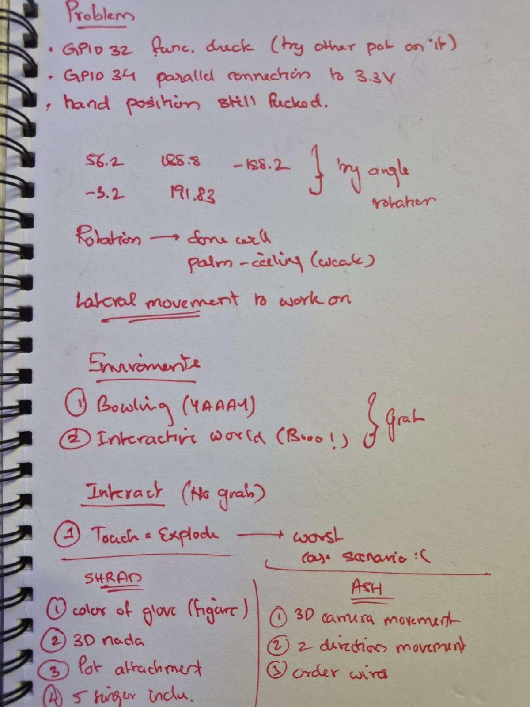
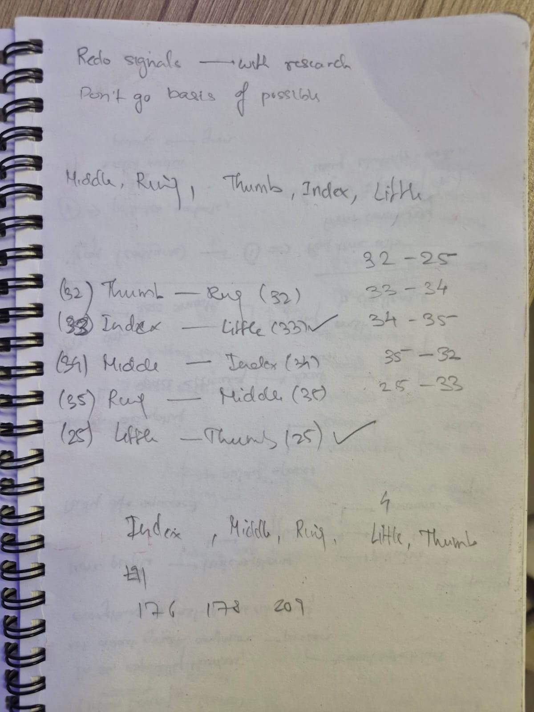


Example:
```md
 
```

## 7.2 Labeled Build Sketch
Add a sketch with labels showing:
- structure,
- electronics placement,
- user touch points,
- moving parts,
- output elements.

**Insert image below:**  
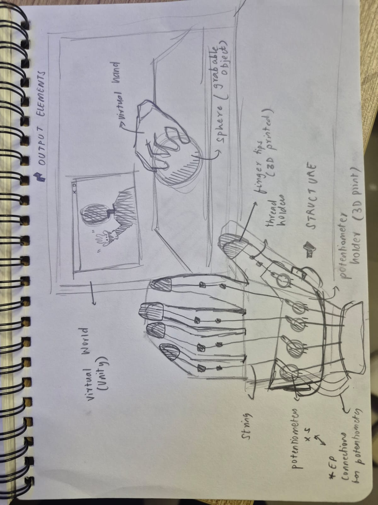
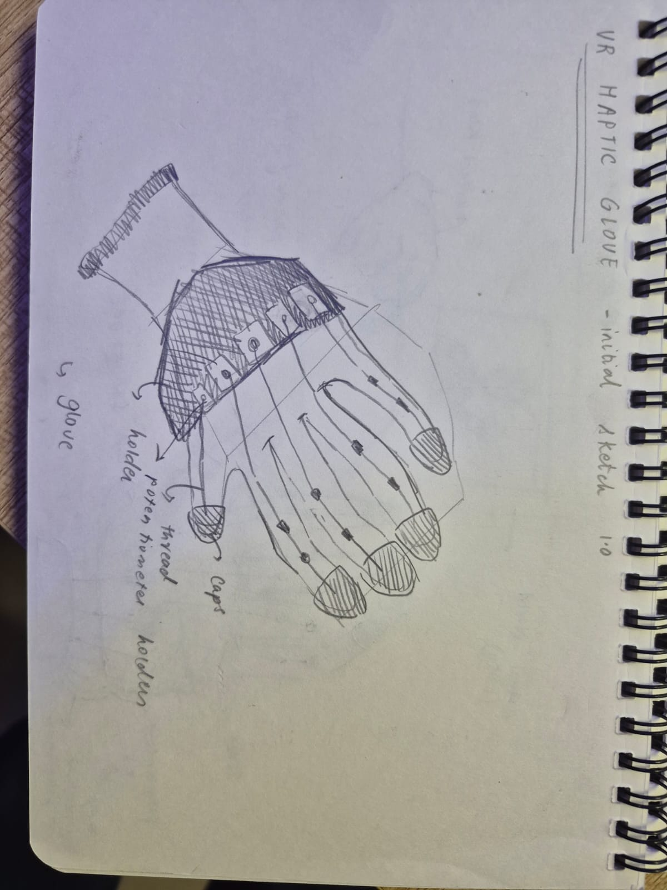
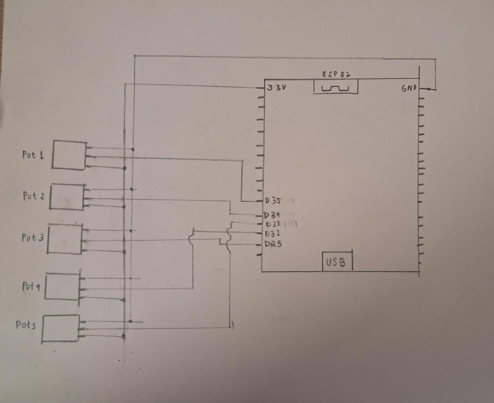


## 7.3 Approximate Dimensions

| Dimension | Value |
|---|---|
| Length | `20 cm (glove)` |
| Width | `6cm-bottom, 13 cm top` |
| Height | `20 cm` |
| Estimated weight | `500 gm approx` |

---

# 8. Mechanical Planning

## 8.1 Mechanical Features
Check all that apply.

- [ ] Gears
- [ ] Pulleys
- [ ] Belt drives
- [+] Linkages
- [ ] Hinges
- [+] Shafts
- [+] Springs
- [ ] Bearings
- [ ] Wheels
- [ ] Sliders
- [ ] Levers
- [ ] Not applicable

## 8.2 Mechanical Description
Describe the mechanism and what it is meant to do.

**Response:**  
`Each potentiometer is on the glove attatched to a foam peice. A rubber band is attached to one end of the potentiometer shaft and a string to the other. When the finger bends, the string pulls the shaft and rotates it, changing the resistance. The rubber band returns the shaft to its original position when the finger straightens. This converts finger curl movement into an electrical signal read by the ESP32. `

## 8.3 Motion Planning
If something moves, explain:
- what moves,
- what causes the movement,
- how far it moves,
- how fast it moves,
- what could go wrong.

**Response:**  
`What moves: The potentiometer shaft rotates when a finger bends.
What causes the movement: The string attached to 
the finger pulls the shaft as the finger curls, 
while the rubber band creates tension to return 
it to the resting position.
How far it moves: The shaft rotates approximately 
270-___  depending on how far the finger curls.
How fast it moves: The shaft moves as fast as the 
finger bends.
What could go wrong: The string could snap or 
detach, the rubber band could lose elasticity 
over time or the potentiometer could shift 
position on the glove giving inconsistent readings.`

## 8.4 Simulation / CAD / Animation Before Making
If your project includes mechanical motion, document the digital planning before fabrication.

| Tool Used | File / Link | What Was Tested |
|---|---|---|
`not applicable since we did not use any simulation except for sketches which are uploaded`

## 8.5 Changes After Digital Testing
What changed after the CAD, animation, or simulation stage?

**Response:**  
`not applicable `

---

# 9. Electronics Planning

## 9.1 Electronics Used

| Component | Quantity | Purpose |
|---|---:|---|
| `[ESP32]` | `1` | `[Main controller]` |
| `Potentiometers` | `5` | `to record the movement of the fingers` |
| `Wires` | `20 m ` | `Connections to breadboard` |

## 9.2 Wiring Plan
Describe the main electrical connections.

**Response:**  
`All the pontetiometers are connected to GND, 3V3 and a GPI04 port. The wires are soldered onto the potentiometer.`

## 9.3 Circuit Diagram
Insert a hand-drawn or software-made circuit diagram.

**Insert image below:**  


## 9.4 Power Plan

| Question | Response |
|---|---|
| Power source | `ESP32` |
| Voltage required | `3.3 V` |
| Current concerns | `5mA total draw from 5 potentiometers, ESP32 3.3V rail can supply up to 300mA, no current concerns identified` |
| Safety concerns | `Loose wires causing sparks, Short circuits` |

---

# 10. Software Planning

## 10.1 Software Tools

| Tool / Platform | Purpose |
|---|---|
| `MicroPython` | `[for connecting virtual world to physical glove. Connecting potentiometer and translating change in angle values to the virtual fingers.]` |
| `Unity` | `creation of virtual world and display to show the movements of real hand on the virtual hand` |
| `VS Code` | `for writing down the script of various assets to add on to the game objects` |
| `Thonny` | `for writing down the code for getting potetiometer values and running it` |

## 10.2 Software Logic
Describe what the code must do.

Include:
- startup behavior,
- input handling,
- sensor reading,
- decision logic,
- output behavior,
- communication logic,
- reset behavior.

**Response:**  
`The system starts with two hardware inputs: a set of 5 potentiometers connected by string that measure finger curl angles (sent over COM6 via Thonny), and a camera that feeds into Mediapipe to track 21 hand landmarks as (x, y) coordinates. Both streams are ingested by hand_tracker.py, which bundles them into UDP packets and broadcasts on port 5005. On the Unity side, UDPReceiver.cs listens for those packets and passes the raw bytes to HandDataHub.cs, which parses them into structured data that the rest of the system can use. VRHandManager.cs then reads from the data hub and applies the values to the hand GameObjects in the scene, while Finger.cs, attached to each finger bone, handles calibration and maps the incoming values to actual bone rotations, producing the final hand and finger motion in VR. A separate script, GrabObject.cs, continuously checks whether finger bend values exceed a grab threshold, and when they do, it triggers a grab or throw action using the velocity at the moment of release. `

## 10.3 Code Flowchart
Insert a flowchart showing your code logic.

Suggested sequence:
- start,
- initialize,
- wait for input,
- read input,
- decision,
- trigger output,
- repeat or reset,
- error handling.

**Insert image below:**  
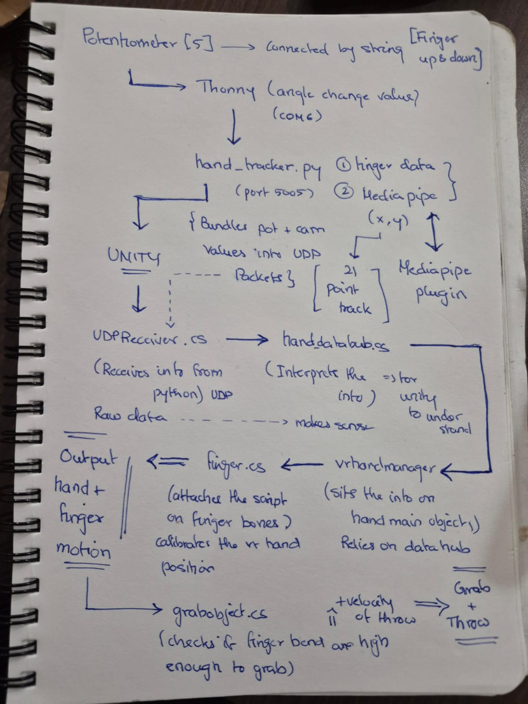

## 10.4 Pseudocode

text
[Write your pseudocode here]
  `START

  INITIALIZE 5 pins on ESP32

  LOOP :
    
    READ value from each potentiometer
   
    
    SEND all 5 values over serial 
    
    --- In Unity ---
    
    RECEIVE serial string from ESP32
    PARSE into 5 finger curl values
    
    IF 3 or more fingers curled > grab threshold THEN
      attach ball to wrist
    
    ELSE IF 2 or more fingers straight < release threshold THEN
      launch ball using wrist velocity
      start respawn timer
    
    IF respawn timer done THEN
      destroy old ball
      spawn new ball
      reset pins

END `

---

# 11. MIT App Inventor Plan

## 11.1 Is an app part of this project?
- [ ] Yes
- [+] No

If yes, complete this section.

## 11.2 Why is the app needed?
Explain what the app adds to the experience.

Examples:
- remote control,
- score tracking,
- mode selection,
- personalization,
- triggering effects,
- displaying data.

**Response:**  
`[Write here]`

## 11.3 App Features

| Feature | Purpose |
|---|---|
| `[Bluetooth connect button]` | `[Purpose]` |
| `[Score display]` | `[Purpose]` |
| `[Control button / slider / label]` | `[Purpose]` |

## 11.4 UI Mockup
Insert a sketch or screenshot of the app interface.

**Insert image below:**  
`[Upload image and link here]`

## 11.5 App Screen Flow

1. `[Step 1]`
2. `[Step 2]`
3. `[Step 3]`
4. `[Step 4]`

---

# 12. Bill of Materials

## 12.1 Full BOM

| Item | Quantity | In Kit? | Need to Buy? | Estimated Cost | Material / Spec | Why This Choice? |
|---|---:|---|---|---:|---|---|
| `[ESP32]` | `1` | `Yes` | `No` | `0` | `[Spec]` | `[Reason]` |
| `potentiometers` | `5 ` | `no` | `[Yes]` | `100` | `[Spec]` | `for recording change in values` |
| `wires` | `20m` | `no` | `[Yes]` | `310` | `metal` | `conenctions` |
| `feviquick` | `5` | `no` | `[Yes]` | `25` | `glue` | `adhesive` |
| `elastic string` | `one roll ` | `no` | `[Yes]` | `20` | `elastic` | `for value detetion + tying` |
| `soldering wire` | `one roll ` | `no` | `[Yes]` | `80 ` | `metal ` | `soldering` |
| `badge reels` | `3 ` | `no` | `[Yes]` | `90` | `thread+spool` | `attatchement` |


## 12.2 Material Justification
Explain why you selected your main materials and components.

Examples:
- Why acrylic instead of cardboard?
- Why MDF instead of 3D print?
- Why servo instead of DC motor?
- Why bearing instead of a plain shaft hole?

**Response:**  
`Potentiometers were chosen over buttons or flex sensors because they provide analog values, allowing us to detect how much each finger is curled rather than just on/off. This gives much more precise control for the grab and throw mechanic.Rubber bands were chosen over springs because they are lightweight, cheap, and flexible enough to stretch with finger movement without restricting natural hand motion.`

## 12.3 Items to Purchase Separately

| Item | Why Needed | Purchase Link | Latest Safe Date to Procure | Status |
|---|---|---|---|---|
| `string ` | `elastic to tie around foam` | `__` | `15/04` | `received` |
| `potentiometers` | `for reading valyes` | `___` | `14/04` | `received` |

## 12.4 Budget Summary

| Budget Item | Estimated Cost |
|---|---:|
| Electronics | `100` |
| Mechanical parts | `__` |
| Fabrication materials | `450` |
| Purchased extras | `[Cost]` |
| Contingency | `[Cost]` |
| **Total** | `550` |

## 12.5 Budget Reflection
If your cost is too high, what can be simplified, removed, substituted, or shared?

**Response:**  
`The overall cost of the project is relatively low since most components like the breadboard, jumper 
wires, and ESP32 were already available. If the cost were too high, we could reduce the number of potentiometers from 5 to 3 fingers, which would still allow grab and release detection while cutting component costs. Rubber bands and string are very cheap substitutes for more expensive return mechanisms like springs.`

---

# 13. Planning the Work

## 13.1 Team Working Agreement
Write how your team will work together.

Include:
- how tasks are divided,
- how decisions are made,
- how progress will be checked,
- what happens if a task is delayed,
- how documentation will be maintained.

**Response:**  
`Our team operates on a collaborative-lead model, where we divide tasks based on our core strengths while supporting each other's progress. Ashvanth leads the Unity environment and system integration, while Shraddha manages the documentation, with both of us sharing responsibility for testing and physical builds. Decisions are made through consensus, though the "Main Owner" of a specific area has the final say if we disagree. We stay on track with constant check-ins every day. If a task is delayed, we immediately communicate to redistribute the workload or adjust our scope. Finally, we maintain documentation in real-time, with Shraddha managing the logs and Ashvanth contributing technical code and logic.`

## 13.2 Task Breakdown

| Task ID | Task | Owner | Estimated Hours | Deadline | Dependency | Status |
`T1 | Finalize concept | Both | 2 | 10/04 | None | finished |
T2 | Complete BOM | Shraddha | 1 | 20/04 | T1 | finished |
T3 | Test electronics | both | 13/04 | T1 | finished |
T4 | Build structure | both | 4 | 18/04 | T1 | finsihed |
T5 | Write control code | Ashvanth | 4 | 16/04 | T3 | finished |
T6 | Integrate system | both | 4 | 17/04 | "T4, T5" | finished |
T7 | Playtest | Both | 2 | 18/04 + 19/04 | T6 | finished |
T8 |Refine and document | Shraddha | 3 |20/04 |T7| finished | `
## 13.3 Responsibility Split

| Area | Main Owner | Support Owner |
|---|---|---|
| Concept and gameplay | `Shraddha` | `Ashvanth` |
| Electronics | `Ashvanth` | `Shraddha` |
| Coding | `Ashvanth` | `Shraddha` |
| App | `Ashvanth` | `Shraddha` |
| Mechanical build | `Shraddha` | `Ashvanth` |
| Testing | `Ashvanth` | `Shraddha` |
| Documentation | `Shraddha` | `Ashvanth` |

---

# 14. Weekly Milestones

## 14.1 Four-Week Plan

### Week 1 — Plan and De-risk
Expected outcomes:
- [ ] Idea finalized
- [ ] Core interaction decided
- [ ] Sketches made
- [ ] BOM completed
- [ ] Purchase needs identified
- [ ] Key uncertainty identified
- [ ] Basic feasibility tested

### Week 2 — Build Subsystems
Expected outcomes:
- [ ] Electronics tests completed
- [ ] CAD / structure planning completed
- [ ] App UI started if needed
- [ ] Mechanical concept tested
- [ ] Main subsystems partially working

### Week 3 — Integrate
Expected outcomes:
- [ ] Physical body built
- [ ] Electronics integrated
- [ ] Code connected to hardware
- [ ] App connected if required
- [ ] First playable version exists

### Week 4 — Refine and Finish
Expected outcomes:
- [ ] Technical bugs reduced
- [ ] Playtesting completed
- [ ] Improvements made
- [ ] Documentation completed
- [ ] Final build ready

## 14.2 Weekly Update Log

| Week | Planned Goal | What Actually Happened | What Changed | Next Steps |
|---|---|---|---|---|
| Week 1 | `finalise idea` | `came up with the picking up of objects and glove idea` | `changed it to the bowling alley` |
| Week 2 | `get products + 3d print ` | `got the products + materials required` | `nothing changed` | `can start planning` |
| Week 3 | `make the scene on unity + get fingers bending to work (figure out potetiometer mechanism` | `came up with a new mechanism as current one did not work` | `connected the knobs of the poteitometer to a rubber band on one end instead` | `figure out how to attatch to the glove` |
| Week 4 | `figure out media pipe + hand tracking + connecting everything together` | `happened as planned` | `no changes` | `test it all out` |

---

# 15. Risks and Unknowns

## 15.1 Risk Register

| Risk | Type | Likelihood | Impact | Mitigation Plan | Owner |

| `Potentiometer shifts on glove during play | Mechanical | High | High | Secure with tape or cable ties to keep aligned with finger joint | [Name] ` |
| `Serial connection drops between ESP32 and Unity | Technical | Medium | High | Restart Thonny and Unity, check USB cable connection | [Name]` |
| `Wires tangle or disconnect during hand movement | Mechanical | High | Medium | Bundle and secure wires along the back of the glove with tape | [Name] `|
| `Potentiometer readings inconsistent between sessions | Technical | Medium | Medium | Recalibrate threshold values in GrabObject before each session | [Name]`|
| `Rubber band snaps during gameplay | Mechanical | Medium | Medium | Keep spare rubber bands available and replace immediately | [Name] `|


## 15.2 Biggest Unknown Right Now
What is the single biggest uncertainty in your project at this stage?

**Response:**  
`The biggest uncertainty is whether the potentiometer  readings will be consistent and reliable enough during actual gameplay. When the glove moves quickly during a throw, the wires and potentiometers may shift position, causing incorrect finger curl readings that could accidentally trigger a grab or release at the wrong time.`

---

# 16. Testing and Playtesting

## 16.1 Technical Testing Plan

| What Needs Testing | How You Will Test It | Success Condition |

`|  What Needs Testing | How You Will Test It | Success Condition |
| Potentiometer readings | Open Thonny serial monitor and bend each finger, check values change from 0-4095 | Each finger shows distinct values when bent and straight |`
`| Serial communication | Print finger values in Thonny and check they appear consistently | All 5 values update in real time without dropping |
| Grab mechanic | Put on glove and curl 3+ fingers around the ball in Unity | Ball attaches to wrist and follows hand movement |
| Throw mechanic | Grab ball then open hand with a throwing motion | Ball launches in the direction of wrist movement |
| Pin collision | Roll ball into pins in Unity | Pins fall over realistically on contact |`

## 16.2 Playtesting Plan

| Question | How You Will Check |
| Do players understand what to do? | `Watch a new player attempt it without instructions` |
| Is the interaction satisfying? | `Ask players if grabbing and throwing felt natural` |
| Do players want another turn? |` Observe if players ask to play again` |
| Is the challenge balanced? | `Check if players can knock pins but not every time` |
| Is the response clear and immediate? | `Check if grab and release happens without delay` |

## 16.3 Testing and Debugging Log

| Date | Problem Found | Type | What You Tried | Result | Next Action |
|---|---|---|---|---|---|
| `[Date]` | `[Describe issue]` | `[Technical / Mechanical / UI / Gameplay]` | `[What you did]` | `[Worked / Partly / Failed]` | `[Next step]` |
| `[Date]` | `[Describe issue]` | `[Type]` | `[What you did]` | `[Result]` | `[Next step]` |

## 16.4 Playtesting Notes

| Tester | What They Did | What Confused Them | What They Enjoyed | What You Will Change |
| [19/04] | Pins floating after being hit | Technical | Added physics material with bounciness 0 | Partly worked | Adjust collider on pin |
| 17/04 | Potentiometer giving inconsistent readings | Technical | Checked wiring connections on breadboard | Worked | No further action needed |
| [18/04] | Grab not triggering consistently | Mechanical | Adjusted grab threshold value in GrabObject | Partly worked | Fine tune threshold values |

---

# 17. Build Documentation

## 17.1 Fabrication Process
Describe how the project was physically made.

Include:
- cutting,
- 3D printing,
- assembly,
- fastening,
- wiring,
- finishing,
- revisions.

**Response:**  
`We had to 3D print the string holders for the finger joints. We then cut out the potentiometer holder out of foam board and attatched that to the glove using super glue. We had to solder the wires to the potetiometer for more stability.`

## 17.2 Build Photos
Add photos throughout the project.

Suggested images:
- early sketch,
- prototype,
- electronics testing,
- mechanism test,
- app screenshot,
- final build.

Example:
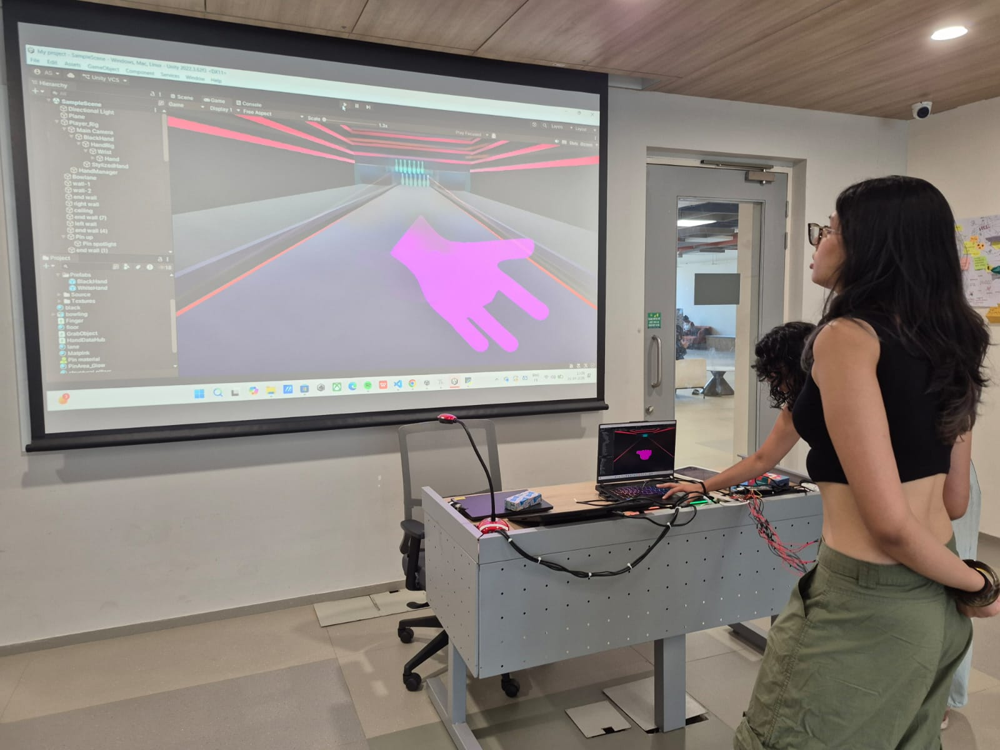
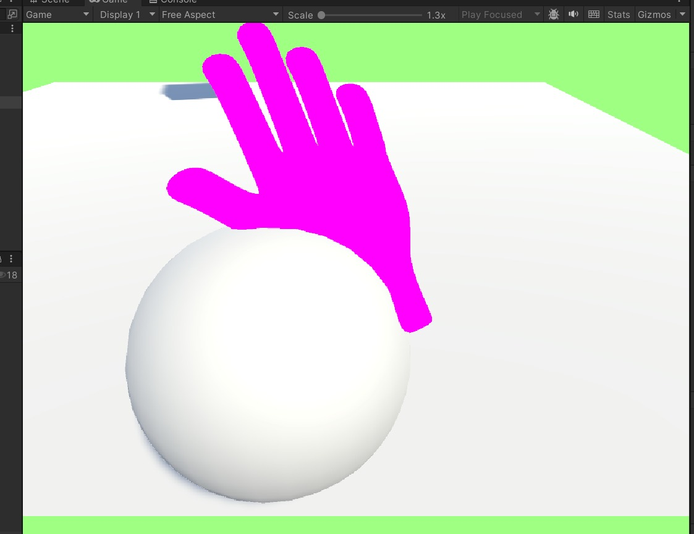

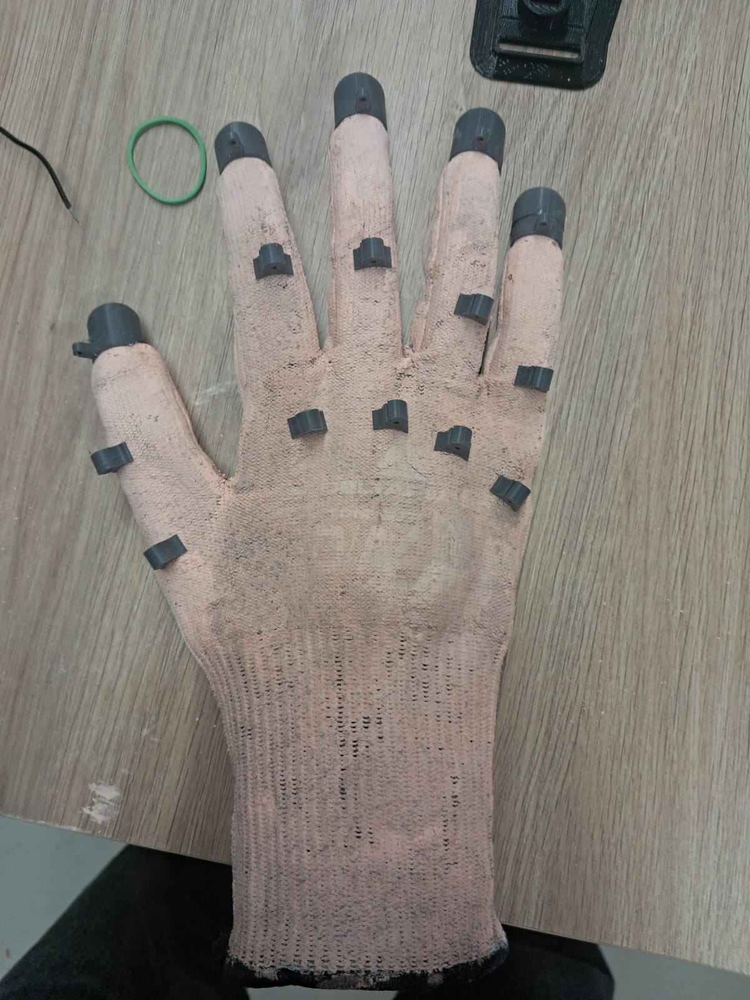
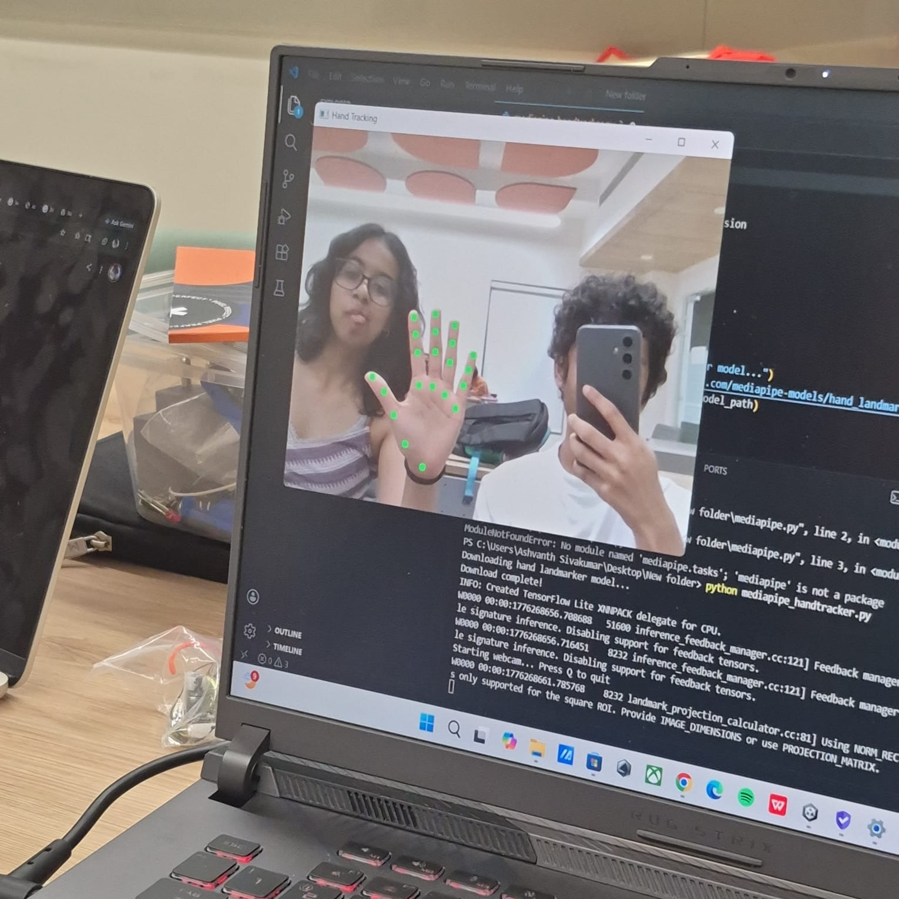


## 17.3 Version History

| Version | Date | What Changed | Why |
|---|---|---|---|
| `v1` | `12/04` | `[Started off with the potetiometer connected to the spool from the badge reel]` | `[the badge reel spool would provdie the tension for it to fall back to its original postion]` |
| `v2` | `15/04` | `the rubber bands are attatched instead and the string was attatched to the 3d printed finger tip ending` | `-` |
| `v3` | `18/04` | `the string is directly attatched to the end of the glove` | `media pipe stopped recognising the hand with the 'unnatural' finger tip endings` |

---

# 18. Final Outcome

## 18.1 Final Description
Describe the final version of your project.

**Response:**  
`The final project is a VR-style bowling game controlled by a diy glove controller. Five potentiometers  on the glove detect finger curl movements, which are read by an ESP32 via Thonny and MicroPython, then sent to Unity where the player can grab, aim and throw a bowling ball in a 3D lane to knock down pins.`

## 18.2 What Works Well
- - Potentiometers accurately detect finger curl and 
  trigger grab/release in Unity
- The throw mechanic uses wrist velocity to launch 
  the ball realistically
  Pins react to collision with proper physics and 
  fall naturally


## 18.3 What Still Needs Improvement
- `Wires on the glove get tangled during movement`
- `Potentiometer readings can be inconsistent between 
  sessions and need recalibration`

## 18.4 What Changed From the Original Plan
How did the project change from the initial idea?

**Response:**  
`Initially the project was just to pick up objects and let go of them. We then re-imagined it to be a bowling alley. `

---

# 19. Reflection

## 19.1 Team Reflection
What did your team do well?  
What slowed you down?  
How well did you manage time, tasks, and responsibilities?

**Response:**  
`Our team communicated well when building and testing the circuit and divided tasks effectively between hardware and software. What slowed us down was troubleshooting the potentiometer connections and getting consistent readings from all 5 fingers. Time management was mostly on track, though debugging took longer than expected.`

## 19.2 Technical Reflection
What did you learn about:
- electronics,
- coding,
- mechanisms,
- fabrication,
- integration?

**Response:**  
`We learned how to wire 5 potentiometers on a breadboard connected to the ESP32's 3.3V rail, using Thonny to write MicroPython that reads each finger's analog values and sends them over serial to Unity, where we built a 3D bowling game that uses the data to control grab and throw mechanics. On the hardware side, we learned how rubber bands and string mounted on the glove convert finger movement into potentiometer shaft rotation and how to manage 5 sets of wires neatly to keep connections stable during movement.`

## 19.3 Design Reflection
What did you learn about:
- designing for play,
- delight,
- clarity,
- physical interaction,
- player understanding,
- iteration?

**Response:**  
`Designing for play led us to think about multiple factors - how one would grip a ball, how many people can play it, how one would slip the glove in etc. The feeling of joy we got when our ball finally hit the pins is what we want all our users to feel as they play the game. It was for the sheer love of them game that we powered through and figured out all the new softwares and methods needed for this project. The need for structure and stability was something we had to rienforce into our heads as the attatchements to the glove contiously kept breaking up as we went through multiple adhesives. It was multiple rounds of trial and error that led us to our final project. We learnt that sticking to the process and having faith in it will lead to our desired outcome.`

## 19.4 If You Had One More Week
What would you improve next?

**Response:**  
`We would have loved to make the glove more easily wearable and customsible for all to try and play. We could have created a more realistic bowling alley envrionment. A more accurate animation of the fingers bending and picking up of the objects.`

---

# 20. Final Submission Checklist

Before submission, confirm that:
- [ ] Team details are complete
- [ ] Project description is complete
- [ ] Inspiration sources are included
- [ ] Player journey is written
- [ ] Sketches are added
- [ ] BOM is complete
- [ ] Purchase list is complete
- [ ] Budget summary is complete
- [ ] Mechanical planning is documented if applicable
- [ ] App planning is documented if applicable
- [ ] Code flowchart is added
- [ ] Task breakdown is complete
- [ ] Weekly logs are updated
- [ ] Risk register is complete
- [ ] Testing log is updated
- [ ] Playtesting notes are included
- [ ] Build photos are included
- [ ] Final reflection is written

---

# 21. Suggested Repository Structure

```text
project-repo/
├── README.md
├── images/
│   ├── concept-sketch.jpg
│   ├── labeled-sketch.jpg
│   ├── circuit-diagram.jpg
│   ├── ui-mockup.jpg
│   ├── prototype-1.jpg
│   └── final-build.jpg
├── code/
│   ├── main.py
│   ├── test_code.py
│   └── notes.md
├── cad/
│   ├── models/
│   └── screenshots/
└── docs/
    ├── references.md
    └── extra-notes.md
```

---

# 22. Instructor Review

## 22.1 Proposal Approval
- [ ] Approved to proceed
- [ ] Approved with changes
- [ ] Rework required before proceeding

**Instructor comments:**  
`[Instructor fills this section]`

## 22.2 Midpoint Review
`[Instructor fills this section]`

## 22.3 Final Review Notes
`[Instructor fills this section]`
